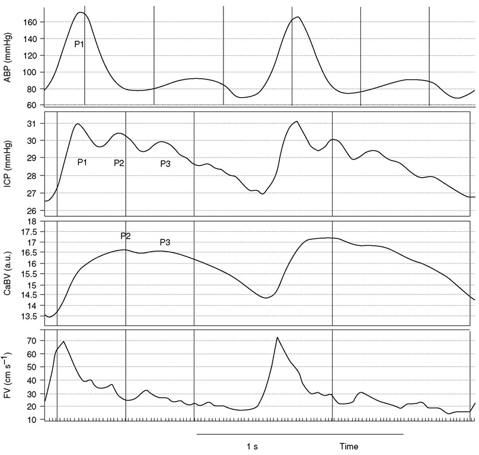

{:: encoding="utf-8" /}

# Neuro-critical care physiology and pathology

## Describe the waveform seen on an ICP monitor

- The waveform should look like normal arterial trace with additional upstroke (P2) between systolic peak (P1) and dicrotic notch (P3); this is the reflected pressure wave from the non compliant skull and should be lower than P1
- When ICP is high then P2>P1

### References

- http://what-when-how.com/neuroanaesthesia-and-neurointensive-care/intracranial-pressure-monitoring-and-imaging-part-3/
- http://jnnp.bmj.com/content/75/6/813.full
