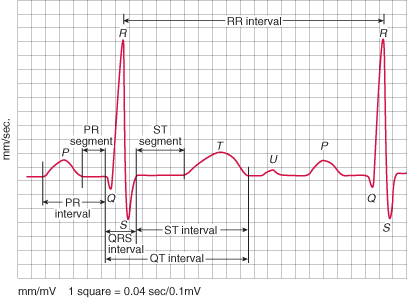
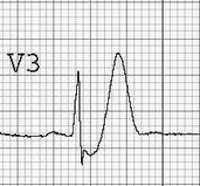
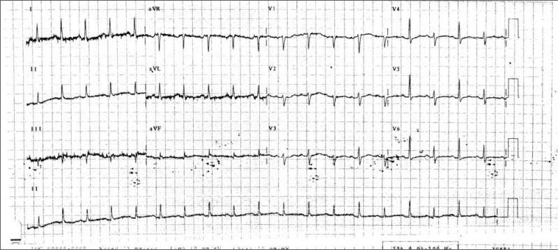
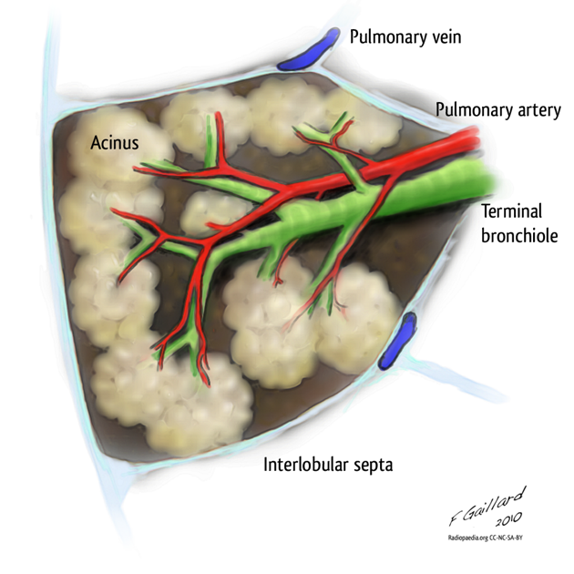

{:: encoding="utf-8" /}

# Investigations

## ECG

### Miscellaneous notes

- to eyeball the QT interval, without formally calculating the corrected time, should be less than half the RR interval
- QT interval is measured from the _start_ of the Q wave to the _end_ of the T wave
- U waves occur after the T-wave, should be in the same direction as the T-wave, and are mostly easily seen at slow heart rates 
- Look carefully for ST elevation > 1mm in aVR as a sign of LAD/Left Main stem occlusion (ST elevation equivalent);Absence of ST elevation in aVR almost entirely excludes a significant LMCA lesion but ST elevation in aVR > 1mm should make you think of LAD or Left Main Stem disease
    + Consider de Winter's T-waves as an STEMI equivalent; present in 2% of LAD disease

- electrical alternans: wandering baseline and alternating QRS complexes or axis between beats associated with pericardial effusion as heart moves in fluid filled sac; Remember to check for associated pulsus paradoxus (fall in blood pressure >10mmHg with inspiration)

## References and credits

- [Normal ECG complex](http://lifeinthefastlane.com/ecg-library/basics/u-wave/)
- de Winter's T-waves  via [Life in the Fastlane](http://lifeinthefastlane.com/winter-is-coming/)

## Chest radiographs

### Basics

- Patient position (look for 'inclinometers: patient supine or upright, and some with dots that indicated the angle of the head of the bed')
- lung volumes: should see 10 ribs (count posterior, and remember that commonly the first seen behind the right apex is the third)
- Well centred? Spinous process between medial head of clavicle
- well penetrated? (just) see intervertebral disc spaces through mediastinum

### Line position

- tip of central lines should be at the caval-atrial border (where bronchus intermedius crosses above right side of heart); note this is lower than alternative recommendation of between clavicles and carina
- laterally pointing central lines should not abut the heart border as there is a risk of perforation. Think of a stiff vascath coming in from the left subclavian, and pushing into the right lateral edge of the right atrium!
- ETT tubes: 2--6cm above carina (and below the clavicular heads)
- carina should be at T6 level (and can sometimes be found by drawing a 45 degree line from the aortic knuckle)

### Locating abnormalities

Think anterior and posterior in terms of silhouettes

- ie descending aorta is posterior so check for silhouette to define a-p position on left? @good
- ditto with hilum
- Right middle lobe is anterior with heart hence silhouette affects right heart border
- right lower lobe is a posterior and sits on diaphragm hence lose diaphragm
- left upper lobe is anterior
- left lower lobe posterior

## CT

Set-up your windows by using Hounsfield units:
    1. Set as window width (WW)
    2. Set window level (WL) which represents the midpoint is midpoint

Useful Hounsfield values

- 0 is water
- -1000 is air
- 3000 is bone
- fat -100 to -50
- blood 30-45
- soft tissue is approx 80 (this is the typical window setting on)

CT chest types

+ non-contrast for lung parenchyma
+ high res (HRCT) for ILD (1-1.5mm slices)
+ contrast for mediasteinum and pleura

### Contrast scans

- Seconds for vascular structures
- minutes for tissue
- double phase for arterial and venous
- triple phase for hepatic? Portal structures
- Bolus tracking if timing is difficult in ICU patients with odd cardiac output where scan is of poor quality with standard timing
- Nephropathy may occur even if on haemodialysis!

### Terminology

+ reticular
+ nodular
+ high attenuation (bright densities)
    * ground glass (GGO): less dense increase which does not obscure the vessels
    * consolidation: dense increase in opacity, obscures vessels
+ low attenuation (low densities)
    * emphysema
    * cystic lung disease

Also see [HRCT Terminology at Radiopaedia](http://radiopaedia.org/articles/hrct-terminology)

### CT anatomy

+ secondary lobules key for understanding disease
    * 1--2cm in diameter
    * made up ofr 5--15 acini
    * surrounded by lymphatics and pulmonary veins that return in the interlobular septae
    * centred on terminal bronchiole: accompanied by pulmonary artery - centrilobular artery

+ centrilobular area is site for diseases that enter via the airways
+ perilymphatics - peripheral part and pathology follows the lymphatics
    * septial thicknening = reticular pattern
        - smooth - fluid
        - nodular: silicosis, sarcoidosis
        - NB: lymphangitic carcinomatosis can create either process

### Classification

Triangulate pattern and distribution (wrt to the secondary lobule), and distribution (with respect to the lung)

What is the  dominant pattern?

- reticular
- nodular
- ground glass
- high attenuation
- low attenuation

What is the distribution with respect to

- the secondary lobule
- within the lung

#### Nodules

Distribution wrt to 2ndary lobule (centrilobular vs perilymphatic, random)

+ e.g. centriobular: in the centre of the connective tissue margins of the secondary lobule (look for space between nodule and pleura)
    * hypersensitivity pneumonitis
    * infectious disease
    * brnochioalveolar cancer
    * NB: an extension of this is 'tree in bud' sign where the terminal bronchiole is inflamed and thickened - think TB, CF, bronchiectasis, ABPA; i.e. inflammation of distal airways)
+ e.g. perilymhatic: along edges
+ random: miliary TB, fungi, metastases

Distribution wrt lung (upper zone, lower, central, peripheral)

+ upper vs lower
+ central vs peripheral

#### Ground glass opacities (GGO)

+ acute: pulmonary oedema, ARDS, pneumonia (esp viral)
+ chronic: hypersensitivity pneumonitis; alveolar proteinoisis

#### High attenuation

Think of this as a denser form of GGO and the differential must be one of blood, pus, cancer, water (oedema)

Further diagnostic refinement will depend on the history, and the next most important question is time course (acute vs chronic)

#### Low attenuation

+ bronchiectasis (dilated bronchioles)
+ cavities (walls greater than 4mm)
    * final stages = honeycombing (differential: interstitial lung disease including drugs and connective tissue)
        - see associated traction bronchiectasis
+ cysts (walled areas <4mm)
+ emphysema (not walled)
    * paraseptal: adjacent to the pleura and interlobar fissures
        - young adults with spontaneous pneumothorax
        - also seen in older smokers (spectrum of centrilobular below)
    * panlobular: affects whole lobulue but lower lobes >> upper lobes
        - think alpha-1 anti-trypsin
        - smokers with advanced emphysema
    * centrilobular
        - most common
        - upper lobe predominance
        - uneven distribution
        - smokers

### References

- [CT Chest Basics](https://www.youtube.com/watch?v=9pLbEq_iz7k)
